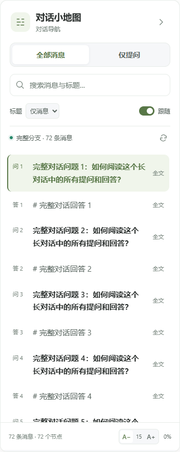
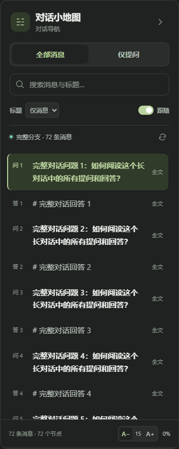

# ChatGPT Mini Map · ChatGPT 小地图

**长对话，也能轻松找到方向。**

一个面向 Microsoft Edge 的轻量扩展，为 ChatGPT 长对话添加可独立滚动的侧边目录。按提问和回答浏览、搜索消息正文、查看全文，并跳转到对应位置。基于原生 JavaScript、CSS 和 Manifest V3，无需构建，无需 API Key。

当前版本：**1.2.2** · [安装](#安装) · [使用](#使用) · [故障排查](#故障排查) · [隐私与权限](#隐私与权限) · [参与贡献](CONTRIBUTING.md) · [更新记录](CHANGELOG.md)

## 预览

| 浅色 | 深色 |
| --- | --- |
|  |  |

截图使用模拟对话，展示 1.2.0 引入、1.2.2 沿用的界面样式。

## 能做什么

- **问答目录**：查看全部消息，或只看自己的提问；可加入 H1–H3 标题。
- **当前分支索引**：尝试读取当前选中分支的完整消息；成功后，网页移除离屏节点也不会清空目录或重新编号。
- **正文搜索与全文阅读**：搜索已索引的完整文本；点击“全文”可在侧栏独立阅读，目录摘要的省略不会截断已读取正文。
- **消息跳转**：点击条目定位消息；目标尚未挂载时，会尝试调整网页滚动位置并等待消息出现。
- **阅读辅助**：独立滚动、当前位置跟随、深浅主题、14–18px 字号调节和偏好保存。
- **明确的读取状态**：显示完整、读取中或失败状态，并提供可复制的诊断。

**完整读取依赖 ChatGPT 当前的页面与内部接口。** 只有显示“完整分支 · N 条消息”时，才表示扩展已取得并校验完整分支。显示“已捕获 N 条”时，目录可能只是部分消息。

## 安装

1. 下载本仓库源码并解压到准备长期保留的文件夹。
2. 在 Edge 地址栏输入 `edge://extensions`。
3. 开启“开发人员模式”，点击“加载解压缩的扩展”。
4. 选择**直接包含 `manifest.json` 的文件夹**，而不是 ZIP 文件或它的上一级目录。
5. 打开已登录的 ChatGPT，刷新整个网页，再进入一条已保存的对话。

无需安装 Node.js 或运行构建命令。加载后保留该文件夹，不要移动或删除。安装方式见 [Microsoft Edge 官方说明](https://learn.microsoft.com/en-us/microsoft-edge/extensions/getting-started/extension-sideloading)。

从旧版升级：覆盖插件文件 → 在扩展管理页重新加载 → 刷新整个 ChatGPT 网页。小地图内的刷新按钮只重新读取数据，不会替换已注入网页的旧脚本。

## 使用

| 操作 | 用法 |
| --- | --- |
| 切换范围 | 选择“全部消息”或“仅提问” |
| 查找内容 | 在搜索框输入正文或标题关键词 |
| 跳转 | 点击目录条目；手动滚动主网页可取消正在进行的定位 |
| 阅读完整文本 | 点击消息旁的“全文”；文本区域可独立滚动 |
| 显示标题 | 在“标题”中选择仅消息、H1、H1–H2 或 H1–H3 |
| 跟随阅读位置 | 开启“跟随”；手动滚动目录时会短暂停止自动跟随 |
| 调整字号 | 使用底部 A− / A+；设置会保存 |
| 收起或展开 | 点击侧栏开关、工具栏弹窗中的开关，或按 `Alt + Shift + M` |
| 重新读取 | 点击状态栏右侧的刷新按钮 |

全文按原始文本显示，可能包含 Markdown 标记。搜索覆盖**已索引**的文本；完整读取未成功时，不代表能搜到全部历史消息。

## 故障排查

| 现象或诊断 | 含义与处理 |
| --- | --- |
| 只显示提问 | 切换到“全部消息”；升级会保留原来的筛选设置 |
| 正在读取完整对话 | 等待读取完成；超时会显示具体错误 |
| 等待对话保存 | 新聊天尚未获得会话地址，暂时只能从页面捕获消息 |
| 完整读取失败 · 已捕获 N 条 | 当前完整索引不可用，已捕获数量不代表对话总数 |
| `BRIDGE_MISSING` | 在扩展管理页重新加载扩展，再刷新整个 ChatGPT 网页 |
| `session` 阶段失败 | 当前页面的登录授权读取没有完成；确认网页能正常访问后刷新 |
| `conversation-authenticated` + HTTP 404 | 已尝试登录授权，接口仍返回 404；可能与账号访问权限、会话状态或接口变化有关，不能直接判定对话尚未保存 |
| HTTP 429 | 请求过于频繁，稍后再试 |
| 跳转未完成 | 网页未能挂载目标消息；可先用“全文”阅读已索引内容 |

仍无法解决时，点击**“复制诊断”**，在仓库 Issues 中附上浏览器版本、扩展版本、复现步骤和诊断文本。复制不可用时可从文本框手动复制。诊断不包含正文、会话 ID、完整 URL 或登录令牌；附加截图时请自行遮挡私人内容。

## 隐私与权限

- 扩展只匹配 `https://chatgpt.com/*` 和 `https://chat.openai.com/*`，会在这些页面注入脚本。
- 清单只声明 `storage` 权限，用于保存展开状态、筛选范围、标题深度、跟随开关和字号。
- 优先读取网页自身成功返回的**当前会话**响应副本；必要时向 ChatGPT 自身发起同源读取。
- 首次会话请求返回 401、403 或 404 时，会尝试读取网站现有登录授权，并向同一会话接口重试一次。令牌仅在该读取过程的内存中使用，不写入存储、不传给第三方，也不通过页面消息传递。
- 对话正文仅保留在当前标签页内存中，切换对话时替换，不写入 `chrome.storage`。
- 没有第三方上传服务、统计代码或远程脚本。不使用开发者计费 API，不需要 API Key。

这是本地运行、使用当前网站登录态读取数据的扩展，并非离线工具。

## 兼容性与限制

- **目标浏览器为 Microsoft Edge。** Chrome 等 Chromium 浏览器尚未单独验证，不在此承诺兼容。
- ChatGPT 的内部接口和虚拟滚动结构可能变化，完整读取和跳转都可能受影响。
- “完整”指**当前选中的可见分支**，不合并编辑提问、重新生成回答产生的其他分支；不展示系统消息、工具消息或隐藏推理。
- 图片、音频、视频和附件通常显示占位说明或文件名，不下载附件，也不识别图片内容。
- 已在隔离 Edge 的模拟会话中验证 72/140 条消息索引、长文本、离屏跳转、读取恢复和路由切换等场景；这不等于所有真实账号与会话都已验证。

## 项目结构

```text
.
├── manifest.json             # MV3 配置与权限
├── conversation-bridge.js    # 页面响应复用、同源读取、登录授权回退
├── conversation-model.js     # 当前分支解析与标题提取
├── navigation.js             # 虚拟化消息定位
├── content.js                # 消息索引、侧栏与全文界面
├── panel.css                 # 侧栏样式
├── popup.html / .css / .js   # 工具栏弹窗
├── icons/                    # 扩展图标
├── docs/                     # 演示图、项目简介和 GitHub 发布指南
├── CONTRIBUTING.md           # 开发与贡献说明
├── CHANGELOG.md              # 版本记录
└── LICENSE                   # MIT 许可证
```

修改源码后，在 Edge 扩展管理页重新加载并刷新 ChatGPT 网页即可调试。详细检查步骤见 [CONTRIBUTING.md](CONTRIBUTING.md)。

## 开源与致谢

本项目采用 [MIT License](LICENSE)，允许使用、修改和分发，包括商业用途；需保留版权及许可声明。许可范围以 LICENSE 全文为准。

功能灵感来自 [GPT Master 小地图](https://gptmaster.app/zh-CN/chatgpt-minimap/)。本项目为独立实现，与 GPT Master、OpenAI 或 Microsoft 没有官方关联。

准备发布自己的仓库？参见 [GitHub 开源发布指南](docs/GITHUB_PUBLISH_GUIDE.md)。
